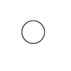

# Assigment 1
## Technology Director : Riszky Hermawan
## Other team member:
- Solver : Aditya Firmansyah Soedira
- Programmer : Ahmad Luhur Pakerti


### Programming Language : Javascript
Pada tugas kali ini kami akan menggunakan bahasa pemrograman Javascript dengan HTML dan CSS. Lebih spesifiknya kita akan menggunakan fitur Canvas dan openCV-js. OpenCV-js dipilih karena instalasi (set up) nya yang mudah. Berikut langkah-langkah set up openCV-js pada web :
1. Buka link script openCV-js di  <br>
Copy semua code dan paste ke file javascript. Kali ini kita akan menamainya ```opencv.js```
2. Masukan code ini pada HTML, sesuaikan atrribute src dengan directory file ```opencv.js``` yang sudah dibuat.
```HTML
<script async src="opencv.js" type="text/javascript"></script>
```

# Documentation
## - Read Image with Js
1. Buat file HTML yang berisi input dan canvas.
```HTML
<!DOCTYPE html>
<html>
<head>
<meta charset="utf-8">
<title>Komgraf</title>
</head>
<body>
<h2>KOMGRAF</h2>
<p id="status">OpenCV.js is loading...</p>
<div>
  <div class="inputoutput">
    
    <div class="caption">imageSrc <input type="file" id="fileInput" name="file" /></div>
  </div>        
  <div class="inputoutput">
    <canvas id="canvasOutput" ></canvas>
    <div class="caption">canvasOutput</div>
  </div>
</div>
<script type="text/javascript" src="script.js">
</script>
<script async src="opencv.js" type="text/javascript"></script>
</body>
</html>
```
 2. Pada ```script.js``` tambahkan code ini pada javasript untuk mengecek apakah openCV sudah berfungsi.
 ```js
 var Module = {
  // https://emscripten.org/docs/api_reference/module.html#Module.onRuntimeInitialized
  onRuntimeInitialized() {
    document.getElementById('status').innerHTML = 'OpenCV.js is ready.';
  }
};
```
 3. Masukkan canvas dan input ke variabel di Javascript.
 ```js
 let imgElement = document.getElementById('imageSrc');
let inputElement = document.getElementById('fileInput');
inputElement.addEventListener('change', (e) => {
  imgElement.src = URL.createObjectURL(e.target.files[0]);
}, false);
 ```
 
 4. Buat onload function untuk membaca file dan menampilkannya dalam canvas
 ```js
 imgElement.onload = () => {
  let mat = cv.imread(imgElement);
  cv.imshow('canvasOutput', mat);
  mat.delete();
 };
 ```

## - Convert Image to Binary
Untuk melakukan konversi gambar biasa ke binary kita akan menggunakan ```function cv.adaptiveThreshold()``` dari openCV. Sebelumnya kita harus menambahkan canvas pada HTML .

1. Tambahkan canvas untuk binary image
```HTML
<canvas id="canvasBinary"></canvas>
```

2. Masukan code ini pada onload function 
```js
let src = cv.imread('canvasOutput');
let dst = new cv.Mat();
cv.threshold(src, dst, 177, 200, cv.THRESH_BINARY);
cv.imshow('canvasBinary', dst);
src.delete();
dst.delete();
```
sehingga onload function akan jadi seperti ini:
```js
imgElement.onload = () => {
  //read image
  let mat = cv.imread(imgElement);
  cv.imshow('canvasOutput', mat);
  mat.delete();


  //read image
  let src = cv.imread('canvasOutput');
  let dst = new cv.Mat();
  cv.threshold(src, dst, 177, 200, cv.THRESH_BINARY);
  cv.imshow('canvasBinary', dst);
  src.delete();
  dst.delete();
};

```
3. Agar lebih rapi, jadikan image yang sebelumnya pada HTML dijadikan ```display:none``` agar web hanya menampilkan 2 gambar yaitu gambar asli dan binary image
```HTML

```


## - Query Pixel
Untuk mengubah gambar menjadi matrix kita menggunakan method yang disediakan oleh openCV js. Dalam openCV js pixel diambil menggunakan RGBA, untuk mengkonversi gambar binary ke matriks kita hanya akan menggunakan nilai alpha saja.
1. Buat 2d array 
```js
let r = [];
  for (let i = 0; i < dst.rows; i++) {
    let c = [];
    for (let j = 0; j < dst.cols; j++) {
      //masukkan nilai disini
    }
    r.push(c);
    c = [];
  }
```
2. Masukkan method yang mengambil nilai alpha dari pixel gambar pada loop. Sehingga loop akan menjadi seperti ini:
```js
let r = [];
  for (let i = 0; i < dst.rows; i++) {
    let c = [];
    for (let j = 0; j < dst.cols; j++) {
      let A = dst.data[i * dst.cols * dst.channels() + j * dst.channels() + 3];
    }
    r.push(c);
    c = [];
  }

```
3. Tambahkan kondisi jika nilai Alpha = 1 maka masukkan nilai 0 pada array, jika Alpha=0 masukkan 1 pada aray. Sehingga loop akan menjadi seperti ini:
```js
let r = [];
  for (let i = 0; i < dst.rows; i++) {
    let c = [];
    for (let j = 0; j < dst.cols; j++) {
      let A = dst.data[i * dst.cols * dst.channels() + j * dst.channels() + 3];
      if(A===0){
        c.push(1);
      }else {
        c.push(0);
      }
    }
    r.push(c);
    c = [];
  }
```
4. Masukkan code pada langkah 3 ke event onload agar ketika gambar selesai di upload, array akan langsung muncul di console.


## - Draw Text on Canvas
Cara untuk memasukan tulisan pada Canvas adalah dengan menggunakan salah satu fitur dari Canvas Javascript, lebih jelasnya sebagai berikut: <br>
Dengan source code yang sama maka :
```js
const canvas = document.getElementById("ourCanvas");
const context = canvas.getContext('2d');

//define font
context.font = "20px Georgia";
//Masukkan text ke Canvas
context.fillText = ("Ini adalah text", 10, 50);
```
Pada method ``` fillText() ``` diisi dengan text yang akan dimasukkan dan posisi nya di Canvas.


## - Animate 
Sebelum memulai animasi, kita harus mengosongkan canvas terlebih dahulu dengan method :
1. KIta gunakan bola sebagai contoh untuk animasi, pertama buat bola di canvas menggunakan code berikut:
```js
const canvas = document.getElementById('canvas');
const ctx = canvas.getContext('2d');

const ball = {
  x: 100,
  y: 100,
  radius: 25,
  color: 'blue',
  draw() {
    ctx.beginPath();
    ctx.arc(this.x, this.y, this.radius, 0, Math.PI * 2, true);
    ctx.closePath();
    ctx.fillStyle = this.color;
    ctx.fill();
  }
};

ball.draw();
```

2. Buat function draw untuk memulai animasi
```js
function draw() {
  ctx.clearRect(0,0, canvas.width, canvas.height);
  ball.draw();
  ball.x += ball.vx;
  ball.y += ball.vy;
  raf = window.requestAnimationFrame(draw);
}
```

3. Kali ini kita akan menggunakan pointer mouse untuk meng-triger animasi untuk mulai. Yaitu ketika kursos diarahkan ke canvas maka animasi dimulai, sebaliknya jika pointer diarahkan keluar maka animasi berhenti. Untuk melakukan itu, kita akan membuat event listener dengan parameter 'onchange' , lebih jelasnya sebagai berikut:
```js
canvas.addEventListener('mouseover', (e) => {
  raf = window.requestAnimationFrame(draw);
});

canvas.addEventListener('mouseout', (e) => {
  window.cancelAnimationFrame(raf);
});

//panggil fungsi draw() untuk menjalankan animasi
ball.draw()
```

4. Untuk mencegah bola bergeser keluar dari canvas, maka kita pasang boundaries atau batas yang jika bola tersebut melewatinya, bola tersebut akan memantul. Untuk itu tambahkan code berikut pada script:
```js
if (ball.y + ball.vy > canvas.height ||
      ball.y + ball.vy < 0) {
    ball.vy = -ball.vy;
  }
  if (ball.x + ball.vx > canvas.width ||
      ball.x + ball.vx < 0) {
    ball.vx = -ball.vx;
  }

```
## - Button
Untuk membuat button , menggunakan elemen HTML yaitu ```<button>``` dengan properti ```onclick()```. 
1. Buat button pada HTML
```HTML
<button onclick="convert()">Mulai Konversi</button>
```
2. Buat fungsi ```convert()``` pada ```script.js``` yang isinya adalah fungsi yang sudah kita buat untuk Get Pixel
```js
const convert = () => {
  //convert img -> binary
  let src = cv.imread('canvasOutput');
  let dst = new cv.Mat.eye(src.rows, src.cols, src.type());
  cv.cvtColor(src, src, cv.COLOR_RGBA2GRAY, 0);
  cv.adaptiveThreshold(src, dst, 200, cv.ADAPTIVE_THRESH_GAUSSIAN_C, cv.THRESH_BINARY, 3, 2);
  cv.imshow('canvasBinary', dst);

  //Buat matriks pixel
  let r = [];
  for (let i = 0; i < dst.rows; i++) {
    let c = [];
    for (let j = 0; j < dst.cols; j++) {
      if (dst.isContinuous()) {
        let A = dst.data[i * dst.cols * dst.channels() + j * dst.channels() + 3];
        if (A === 0) {
          c.push(1);
        } else {
          c.push(0);
        }
      }
    }
    r.push(c);
    c = [];
  }

  console.table(r);
  src.delete();
  dst.delete();
}
```


# Image 



  
